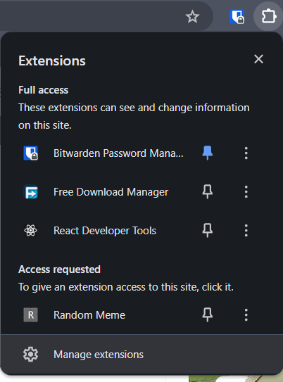
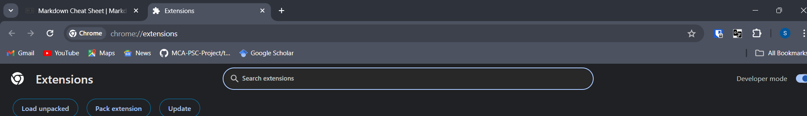
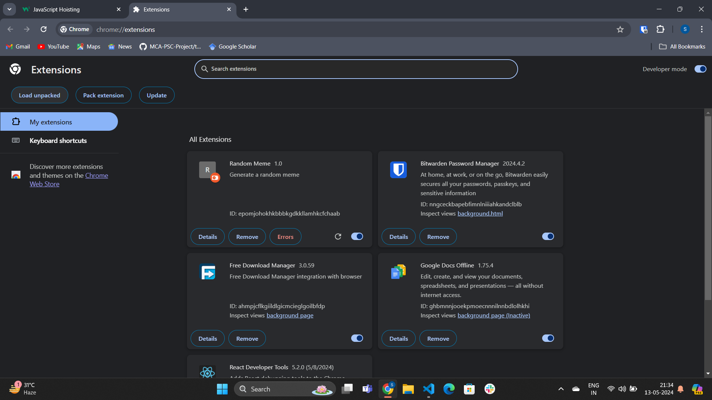
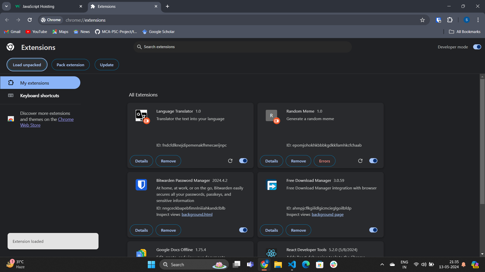
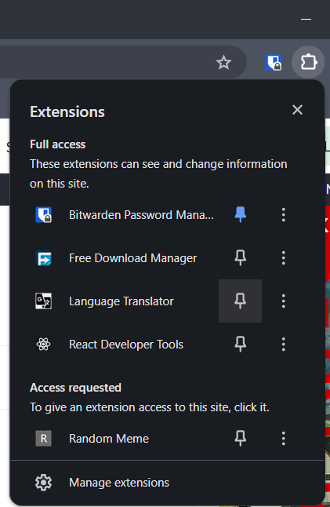
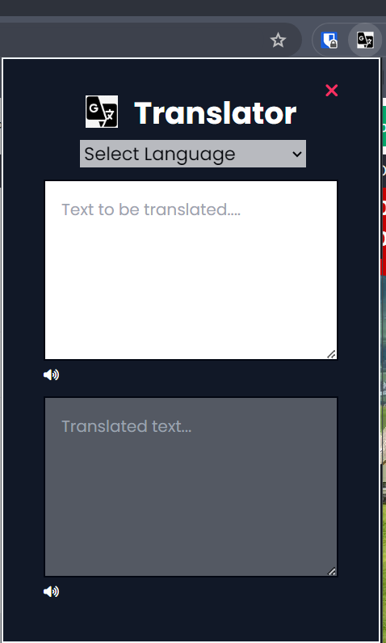
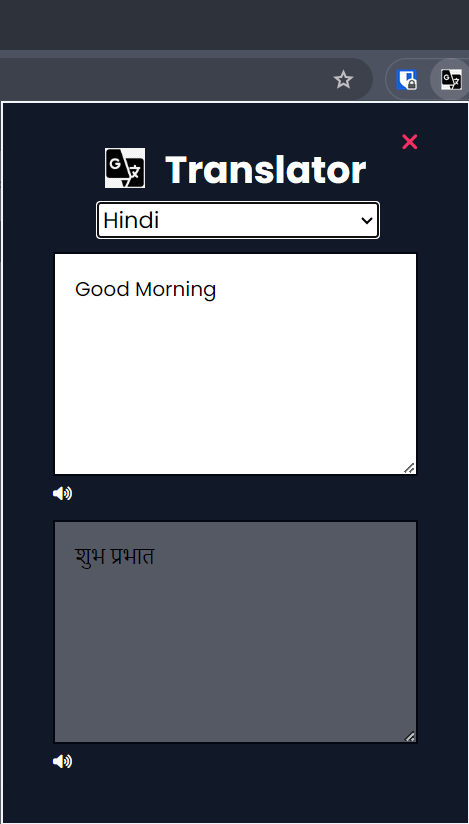
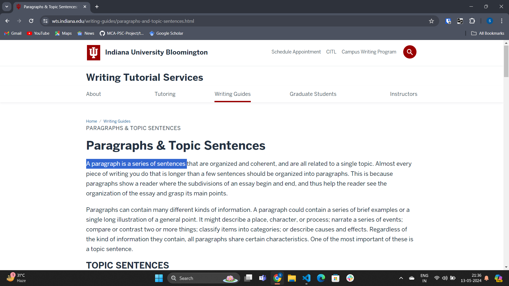
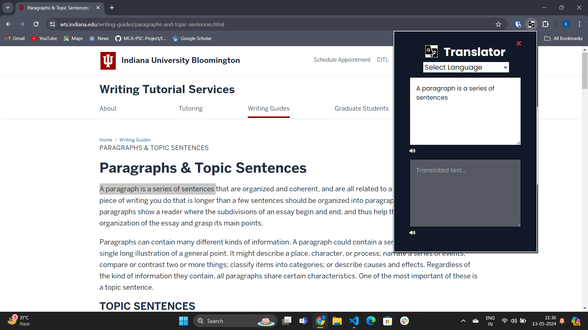

# Translator 🌐

### ⌨️ A language translation chrome extension ⌨️
It instantly translates words,phrases, and web pages from English and to  100 other languages.

## Repository link ✨
[https://github.com/sheetalgithub30/translator-chrome_extension.git](https://github.com/sheetalgithub30/translator-chrome_extension.git)

##  Technologies ⚙️

 #### 1. HTML  
<ul>HTML is a programming language which is used for structuring web Pages including headers, navigation bars, content sections, and footers. </ul>

 #### 2. CSS  
<ul>Applied for styling and layout with different CSS properties </ul>

#### 3. JAVASCRIPT 
<ul>JavaScript is a dynamic programming language that is used for web development, in web applications, for game development, and lots more. It allows you to implement dynamic features on web pages that cannot be done with only HTML and CSS.</ul>

  

##  Features 👌

1. **🥰 Tailwind CSS** - For designing , CSS framework **Tailwind** is used.

2. **🔊 Speech Synthesis Utterance** - A web API function speechSynthesisUtterance is used to fulfil a speech request for both input and output text/value. 
 
3. **💬 Give input value** - User can direct type a word or sentence, they want to translation of.

4. **📜 Reading Chrome text** - User can select a word or sentence from chrome that they want to translate.

5. **💪 Convenient to use** - It is very easy to use. It is like having a personal translator right at your fingertips!.
 
6. **🔍Google Fonts and icons**- Font Awesome is a comprehensive icon library that offers a vast selection of icons for various purposes, such as user interface design, web development and graphic design. Goggle font Poppins was used.

7. **🙌 API's** - API request like POST and GET are used .

## How to use 😀

1. Get this folder in your remote device. (clone or fork this repository).
   
&nbsp;

2. Open Chrome Extensions: Type chrome://extensions/ in the address bar and press Enter.

- 
  
  
&nbsp;

3. Enable Developer Mode: Toggle on the “Developer mode” switch in the top right corner.
- 

&nbsp;

4. Load Your Extension:
   - Click the “Load unpacked” button.
   - Navigate to the folder containing your extension files (manifest.json, HTML, CSS, JavaScript, etc.).
   - Select the folder and click “Open.”

- 
  
&nbsp;

5. Test Your Extension: Your extension should now appear in the list of installed extensions. 
- 

&nbsp;

- 

&nbsp;

- 

&nbsp;

- 

&nbsp;

- 

&nbsp;

- 

&nbsp;

-     
